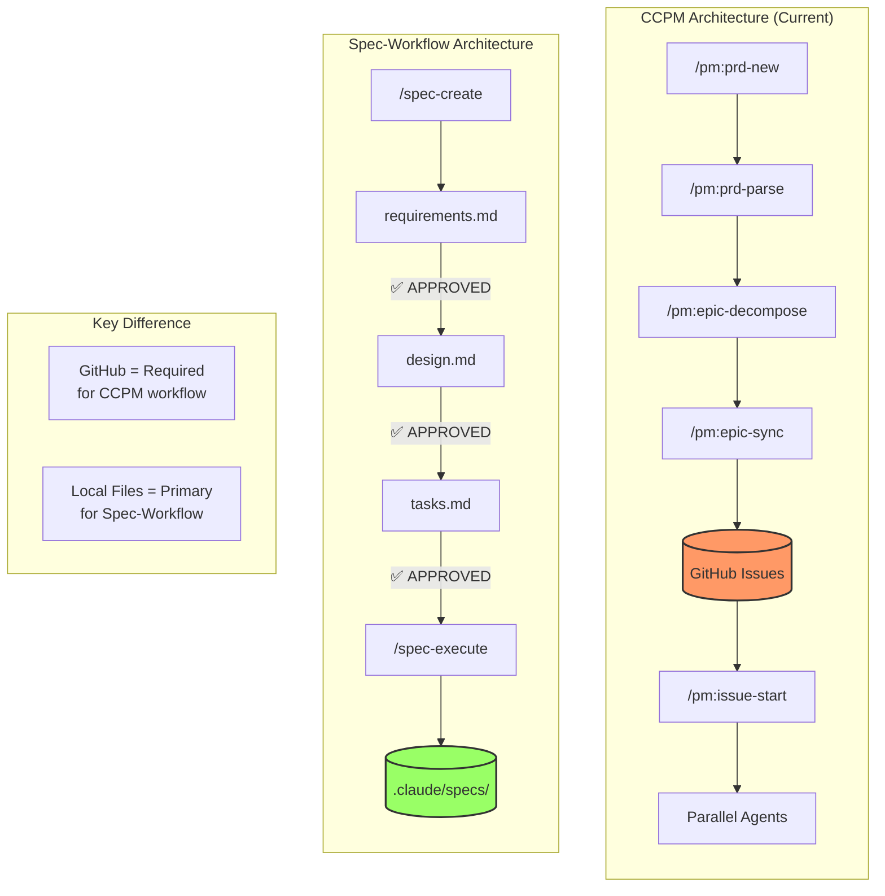
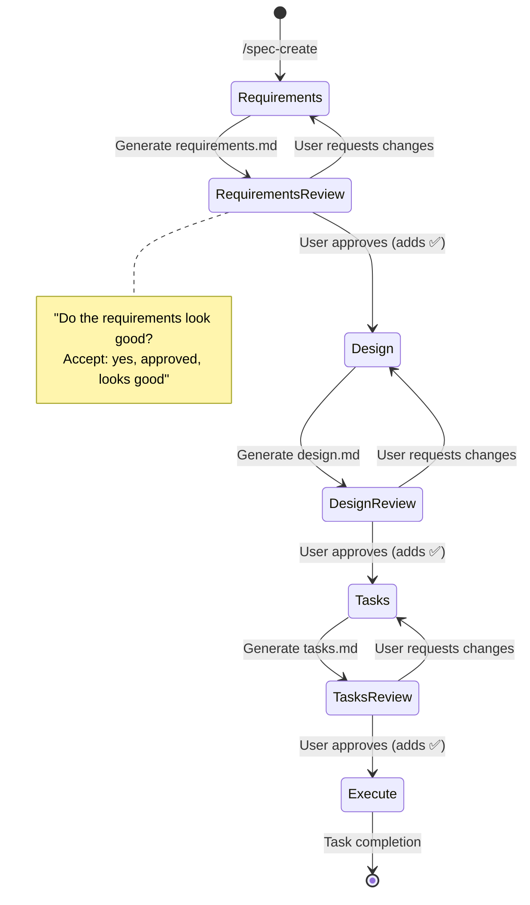
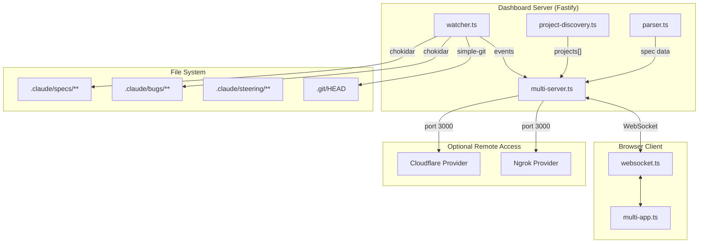
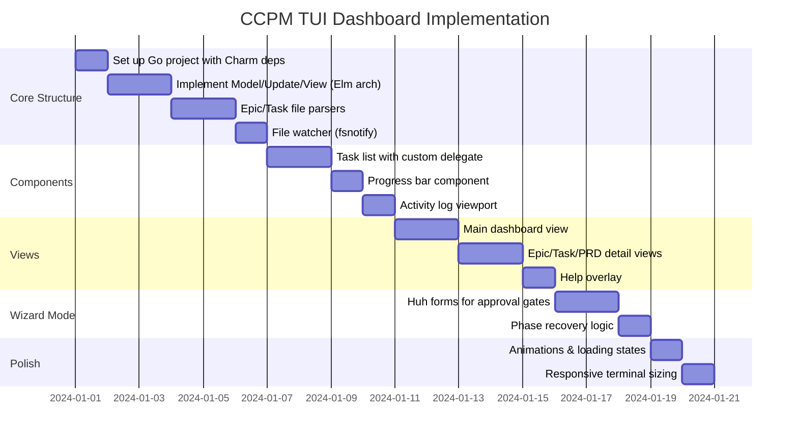
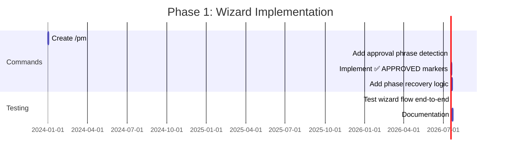
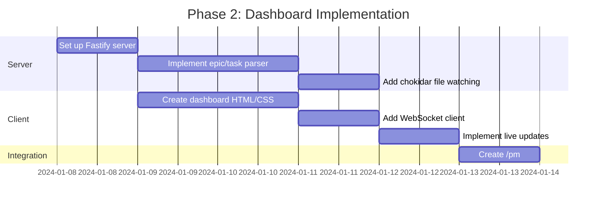
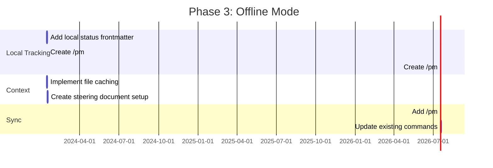

# Spec-Workflow Feature Analysis for CCPM

> **Analysis Date**: 2025-12-23
> **Purpose**: Identify features from `claude-code-spec-workflow` that would benefit CCPM for solo developers who value offline workflows and visual feedback.
> **Decision**: ✅ **TUI Dashboard selected** (see [TUI-WIREFRAMES.md](./TUI-WIREFRAMES.md) and [TUI-DASHBOARD-DESIGN.md](./TUI-DASHBOARD-DESIGN.md))

---

## Related Documents

| Document | Purpose |
|----------|---------|
| [TUI-WIREFRAMES.md](./TUI-WIREFRAMES.md) | Complete visual design system with 18 wireframes |
| [TUI-DASHBOARD-DESIGN.md](./TUI-DASHBOARD-DESIGN.md) | Technical architecture for Charm-based TUI |
| [CCPM-ADOPTION-SPEC.md](./CCPM-ADOPTION-SPEC.md) | What CCPM should adopt from spec-workflow |

---

## Table of Contents

1. [Executive Summary](#executive-summary)
2. [Architecture Comparison](#architecture-comparison)
3. [Feature Deep-Dive: Wizards](#feature-deep-dive-wizards)
4. [Feature Deep-Dive: Dashboard](#feature-deep-dive-dashboard)
5. [Feature Deep-Dive: Offline-First](#feature-deep-dive-offline-first)
6. [Gap Analysis: Solo Developer Needs](#gap-analysis-solo-developer-needs)
7. [Recommended Adoptions](#recommended-adoptions)
8. [Implementation Roadmap](#implementation-roadmap)

---

## Executive Summary

```
┌─────────────────────────────────────────────────────────────────────────────┐
│                     FEATURE ADOPTION RECOMMENDATION                          │
├─────────────────────────────────────────────────────────────────────────────┤
│                                                                              │
│  PRIORITY 1 (CRITICAL)                                                       │
│  ┌─────────────────────────────────────────────────────────────────────┐    │
│  │  🔲 Phase-Based Wizard UX with Approval Gates                       │    │
│  │     • Stops workflow for user review between phases                 │    │
│  │     • Marks documents with ✅ APPROVED status                       │    │
│  │     • Enables mid-workflow revision loops                           │    │
│  └─────────────────────────────────────────────────────────────────────┘    │
│                                                                              │
│  PRIORITY 2 (HIGH VALUE)                                                     │
│  ┌─────────────────────────────────────────────────────────────────────┐    │
│  │  🔲 Real-Time Dashboard with WebSocket Updates                      │    │
│  │     • Visual progress tracking across epics/issues                  │    │
│  │     • File watcher for instant status updates                       │    │
│  │     • Optional remote access via Cloudflare tunnels                 │    │
│  └─────────────────────────────────────────────────────────────────────┘    │
│                                                                              │
│  PRIORITY 3 (ENHANCEMENT)                                                    │
│  ┌─────────────────────────────────────────────────────────────────────┐    │
│  │  🔲 Enhanced Offline-First Mode                                     │    │
│  │     • GitHub-optional workflows                                     │    │
│  │     • Local-only epic/issue tracking                                │    │
│  │     • File-based status persistence                                 │    │
│  └─────────────────────────────────────────────────────────────────────┘    │
│                                                                              │
│  PRIORITY 4 (NICE-TO-HAVE)                                                   │
│  ┌─────────────────────────────────────────────────────────────────────┐    │
│  │  🔲 Steering Documents Integration                                  │    │
│  │     • Three curated docs: product.md, tech.md, structure.md         │    │
│  │     • Automatic reference in all commands                           │    │
│  │     • Context caching with TTL                                      │    │
│  └─────────────────────────────────────────────────────────────────────┘    │
│                                                                              │
└─────────────────────────────────────────────────────────────────────────────┘
```

---

## Architecture Comparison

### Current State



### Workflow Flow Comparison

```
┌─────────────────────────────────────────────────────────────────────────────┐
│                           CCPM WORKFLOW FLOW                                 │
├─────────────────────────────────────────────────────────────────────────────┤
│                                                                              │
│  User Input                                                                  │
│      │                                                                       │
│      ▼                                                                       │
│  ╔═══════════════╗      ╔═══════════════╗      ╔═══════════════╗           │
│  ║  prd-new      ║─────▶║  prd-parse    ║─────▶║ epic-decompose║           │
│  ║  (Guided)     ║      ║  (Auto)       ║      ║ (Auto)        ║           │
│  ╚═══════════════╝      ╚═══════════════╝      ╚═══════════════╝           │
│                                                       │                      │
│                         ┌─────────────────────────────┘                      │
│                         │                                                    │
│                         ▼                                                    │
│                  ╔═══════════════╗                                          │
│                  ║  epic-sync    ║──────────▶ GitHub Issues                 │
│                  ║  (REQUIRED)   ║           (Source of Truth)              │
│                  ╚═══════════════╝                                          │
│                                                                              │
│  ⚠️  NO PAUSE POINTS between phases                                         │
│  ⚠️  GitHub sync is MANDATORY for issue tracking                            │
│                                                                              │
└─────────────────────────────────────────────────────────────────────────────┘

┌─────────────────────────────────────────────────────────────────────────────┐
│                       SPEC-WORKFLOW WORKFLOW FLOW                            │
├─────────────────────────────────────────────────────────────────────────────┤
│                                                                              │
│  User Input                                                                  │
│      │                                                                       │
│      ▼                                                                       │
│  ╔═══════════════╗                                                          │
│  ║  PHASE 1:     ║                                                          │
│  ║  Requirements ║                                                          │
│  ╚═══════════════╝                                                          │
│         │                                                                    │
│         ▼                                                                    │
│  ┌─────────────────┐                                                        │
│  │ "Do requirements│◀────── User reviews requirements.md                    │
│  │  look good?"    │                                                        │
│  └─────────────────┘                                                        │
│    │           │                                                            │
│   YES         NO ──────▶ Revision loop                                      │
│    │                                                                        │
│    ▼  (Adds ✅ APPROVED)                                                    │
│  ╔═══════════════╗                                                          │
│  ║  PHASE 2:     ║                                                          │
│  ║  Design       ║                                                          │
│  ╚═══════════════╝                                                          │
│         │                                                                    │
│         ▼                                                                    │
│  ┌─────────────────┐                                                        │
│  │ "Do the design  │◀────── User reviews design.md                          │
│  │  look good?"    │                                                        │
│  └─────────────────┘                                                        │
│    │           │                                                            │
│   YES         NO ──────▶ Revision loop                                      │
│    │                                                                        │
│    ▼  (Adds ✅ APPROVED)                                                    │
│  ╔═══════════════╗                                                          │
│  ║  PHASE 3:     ║                                                          │
│  ║  Tasks        ║                                                          │
│  ╚═══════════════╝                                                          │
│         │                                                                    │
│         ▼                                                                    │
│  ╔═══════════════╗                                                          │
│  ║  PHASE 4:     ║──────▶ Local .claude/specs/                              │
│  ║  Execute      ║       (Source of Truth)                                  │
│  ╚═══════════════╝                                                          │
│                                                                              │
│  ✅ PAUSE POINTS between every phase                                        │
│  ✅ 100% offline operation                                                  │
│                                                                              │
└─────────────────────────────────────────────────────────────────────────────┘
```

---

## Feature Deep-Dive: Wizards

### Current Spec-Workflow Wizard Implementation



### Key Wizard Patterns to Adopt

```
┌─────────────────────────────────────────────────────────────────────────────┐
│                        WIZARD PATTERN: APPROVAL GATES                        │
├─────────────────────────────────────────────────────────────────────────────┤
│                                                                              │
│  WHAT IT IS:                                                                 │
│  ────────────                                                               │
│  Explicit pause points where Claude asks for user confirmation before        │
│  proceeding to the next phase. User must actively approve.                   │
│                                                                              │
│  HOW IT WORKS:                                                               │
│  ─────────────                                                              │
│  1. Claude completes phase output (e.g., requirements.md)                   │
│  2. Claude asks: "Do the requirements look good?"                           │
│  3. USER MUST RESPOND with approval phrase                                  │
│  4. On approval, Claude marks document with "✅ APPROVED"                   │
│  5. Only then does Claude proceed to next phase                             │
│                                                                              │
│  APPROVAL PHRASES RECOGNIZED:                                               │
│  ─────────────────────────────                                              │
│  • "yes"                                                                    │
│  • "approved"                                                               │
│  • "looks good"                                                             │
│  • "proceed"                                                                │
│  • "continue"                                                               │
│                                                                              │
│  STATE PERSISTENCE:                                                          │
│  ──────────────────                                                         │
│  • ✅ APPROVED marker in file header                                        │
│  • File existence (design.md exists = past requirements phase)              │
│  • Checkbox status: - [x] vs - [ ]                                          │
│                                                                              │
│  RECOVERY:                                                                   │
│  ─────────                                                                  │
│  If user runs /spec-create feature-name again:                              │
│  • Check if requirements.md has ✅ APPROVED → Skip to Design                │
│  • Check if design.md has ✅ APPROVED → Skip to Tasks                       │
│  • Resume from last incomplete phase                                        │
│                                                                              │
└─────────────────────────────────────────────────────────────────────────────┘
```

### Proposed CCPM Wizard Implementation

```
┌─────────────────────────────────────────────────────────────────────────────┐
│                      PROPOSED: /pm:epic-wizard {name}                        │
├─────────────────────────────────────────────────────────────────────────────┤
│                                                                              │
│  ╔═══════════════════════════════════════════════════════════════════════╗  │
│  ║  PHASE 1: PRD CREATION                                                ║  │
│  ║  ───────────────────────                                              ║  │
│  ║  • Guided brainstorming (existing /pm:prd-new behavior)               ║  │
│  ║  • Output: .claude/prds/{name}.md                                     ║  │
│  ║  • PAUSE: "Review the PRD. Ready to continue?"                        ║  │
│  ║  • On approval: Add ✅ APPROVED to PRD frontmatter                    ║  │
│  ╚═══════════════════════════════════════════════════════════════════════╝  │
│                              │                                               │
│                              ▼                                               │
│  ╔═══════════════════════════════════════════════════════════════════════╗  │
│  ║  PHASE 2: EPIC GENERATION                                             ║  │
│  ║  ────────────────────────                                             ║  │
│  ║  • Parse PRD into epic structure (existing /pm:prd-parse)             ║  │
│  ║  • Output: .claude/epics/{name}/epic.md                               ║  │
│  ║  • PAUSE: "Review epic structure. Ready to decompose?"                ║  │
│  ║  • On approval: Add ✅ APPROVED to epic.md                            ║  │
│  ╚═══════════════════════════════════════════════════════════════════════╝  │
│                              │                                               │
│                              ▼                                               │
│  ╔═══════════════════════════════════════════════════════════════════════╗  │
│  ║  PHASE 3: TASK DECOMPOSITION                                          ║  │
│  ║  ───────────────────────────                                          ║  │
│  ║  • Break into ordered tasks (existing /pm:epic-decompose)             ║  │
│  ║  • Output: .claude/epics/{name}/001.md, 002.md, ...                   ║  │
│  ║  • PAUSE: "Review {N} tasks. Ready to begin work?"                    ║  │
│  ║  • On approval: Mark epic as "approved-for-work"                      ║  │
│  ╚═══════════════════════════════════════════════════════════════════════╝  │
│                              │                                               │
│                              ▼                                               │
│  ╔═══════════════════════════════════════════════════════════════════════╗  │
│  ║  PHASE 4: OPTIONAL GITHUB SYNC                                        ║  │
│  ║  ─────────────────────────────                                        ║  │
│  ║  • Ask: "Sync to GitHub? (yes/no/skip)"                               ║  │
│  ║  • If yes: Execute /pm:epic-sync                                      ║  │
│  ║  • If no/skip: Continue with local-only tracking                      ║  │
│  ╚═══════════════════════════════════════════════════════════════════════╝  │
│                              │                                               │
│                              ▼                                               │
│  ╔═══════════════════════════════════════════════════════════════════════╗  │
│  ║  PHASE 5: EXECUTION                                                   ║  │
│  ║  ─────────────                                                        ║  │
│  ║  • Launch work on first task (or user-selected task)                  ║  │
│  ║  • After each task: PAUSE for review                                  ║  │
│  ║  • Continue until all tasks complete                                  ║  │
│  ╚═══════════════════════════════════════════════════════════════════════╝  │
│                                                                              │
└─────────────────────────────────────────────────────────────────────────────┘
```

---

## Feature Deep-Dive: Dashboard

### Spec-Workflow Dashboard Architecture



### Key Dashboard Components

```
┌─────────────────────────────────────────────────────────────────────────────┐
│                         DASHBOARD TECHNICAL STACK                            │
├─────────────────────────────────────────────────────────────────────────────┤
│                                                                              │
│  FILE WATCHING (watcher.ts)                                                  │
│  ──────────────────────────                                                 │
│  • Library: chokidar (cross-platform file watching)                         │
│  • macOS: Uses native FSEvents (efficient)                                  │
│  • Linux: Falls back to polling (1s interval)                               │
│  • Monitors: specs/, bugs/, steering/, .git/                                │
│  • Debounce: 100ms stabilization delay                                      │
│                                                                              │
│  SPEC PARSING (parser.ts)                                                    │
│  ────────────────────────                                                   │
│  • Status detection: not-started → requirements → design → tasks → done     │
│  • Task extraction: Parses - [x] / - [ ] checkboxes                         │
│  • Progress calculation: completed / total tasks                            │
│  • Approval detection: Scans for ✅ APPROVED marker                         │
│                                                                              │
│  WEBSOCKET PROTOCOL                                                          │
│  ─────────────────────                                                      │
│  • Message types (discriminated union):                                     │
│    - InitialDataMessage: Full project state on connect                      │
│    - UpdateDataMessage: Spec/task changes                                   │
│    - BugUpdateMessage: Bug status changes                                   │
│    - ActiveSessionsUpdateMessage: Which tasks are in-progress               │
│    - TunnelStartedMessage / TunnelStoppedMessage                            │
│  • Auto-reconnect: Exponential backoff (1s → 30s max)                       │
│  • Validation: Type guards for all message types                            │
│                                                                              │
│  PROJECT DISCOVERY (project-discovery.ts)                                    │
│  ─────────────────────────────────────────                                  │
│  • Search paths: ~/Projects, ~/Code, ~/repos, etc.                          │
│  • Depth: Up to 4 levels deep                                               │
│  • Detection: Looks for .claude/ directory                                  │
│  • Active session: Detects running Claude processes via lsof                │
│                                                                              │
│  TUNNELING (tunnel/*.ts)                                                     │
│  ───────────────────────                                                    │
│  • Providers: Cloudflare (free), Ngrok (auth required)                      │
│  • Health monitoring: 30s interval check                                    │
│  • Auto-recovery: Reconnects on failure (3 retries)                         │
│  • Access control: Optional password protection                             │
│                                                                              │
└─────────────────────────────────────────────────────────────────────────────┘
```

### Proposed CCPM Dashboard (TUI - SELECTED)

> **✅ DECISION**: TUI Dashboard was selected over web dashboard. See:
> - [TUI-WIREFRAMES.md](./TUI-WIREFRAMES.md) for 18 complete view wireframes
> - [TUI-DASHBOARD-DESIGN.md](./TUI-DASHBOARD-DESIGN.md) for Charm/Bubbletea architecture

```
┌─────────────────────────────────────────────────────────────────────────────┐
│                        SELECTED: TUI Dashboard (ccpm-tui)                    │
├─────────────────────────────────────────────────────────────────────────────┤
│                                                                              │
│  ╔═══════════════════════════════════════════════════════════════════════╗  │
│  ║                         CCPM DASHBOARD                                 ║  │
│  ║                    Terminal-native • Charm libraries                   ║  │
│  ╠═══════════════════════════════════════════════════════════════════════╣  │
│  ║                                                                        ║  │
│  ║  ┌──────────────────────────────────────────────────────────────────┐ ║  │
│  ║  │  PROJECT: my-app                           Branch: epic/auth     │ ║  │
│  ║  │  ──────────────────────────────────────────────────────────────  │ ║  │
│  ║  │                                                                  │ ║  │
│  ║  │  ACTIVE EPIC: user-authentication                               │ ║  │
│  ║  │  ┌────────────────────────────────────────────────────────────┐ │ ║  │
│  ║  │  │ Progress: ██████████░░░░░░░░░░ 50% (3/6 tasks)            │ │ ║  │
│  ║  │  └────────────────────────────────────────────────────────────┘ │ ║  │
│  ║  │                                                                  │ ║  │
│  ║  │  TASKS                                                          │ ║  │
│  ║  │  ┌──────────────────────────────────────────────────────────┐  │ ║  │
│  ║  │  │ ✅ 001: Set up auth middleware                            │  │ ║  │
│  ║  │  │ ✅ 002: Create user model                                 │  │ ║  │
│  ║  │  │ ✅ 003: Implement login endpoint                          │  │ ║  │
│  ║  │  │ 🔄 004: Add session management       ← IN PROGRESS        │  │ ║  │
│  ║  │  │ ⏳ 005: Create registration flow                          │  │ ║  │
│  ║  │  │ ⏳ 006: Add password reset                                │  │ ║  │
│  ║  │  └──────────────────────────────────────────────────────────┘  │ ║  │
│  ║  │                                                                  │ ║  │
│  ║  │  RECENT ACTIVITY (live updates)                                 │ ║  │
│  ║  │  ┌──────────────────────────────────────────────────────────┐  │ ║  │
│  ║  │  │ 14:32 - Task 003 completed                               │  │ ║  │
│  ║  │  │ 14:28 - Task 004 started                                 │  │ ║  │
│  ║  │  │ 14:15 - Epic approved for work                           │  │ ║  │
│  ║  │  └──────────────────────────────────────────────────────────┘  │ ║  │
│  ║  └──────────────────────────────────────────────────────────────────┘ ║  │
│  ║                                                                        ║  │
│  ║  [View PRD] [View Epic] [View Tasks] [GitHub Sync] [Share Dashboard]  ║  │
│  ╚═══════════════════════════════════════════════════════════════════════╝  │
│                                                                              │
└─────────────────────────────────────────────────────────────────────────────┘
```

### Dashboard Implementation Plan (TUI)

> **Note**: Implementation uses Charm libraries (Bubbletea, Bubbles, Lipgloss, Huh) instead of web stack.
> See [TUI-DASHBOARD-DESIGN.md](./TUI-DASHBOARD-DESIGN.md) for complete technical specification.



---

## Feature Deep-Dive: Offline-First

### Current Spec-Workflow Offline Architecture

```
┌─────────────────────────────────────────────────────────────────────────────┐
│                    OFFLINE-FIRST ARCHITECTURE                                │
├─────────────────────────────────────────────────────────────────────────────┤
│                                                                              │
│  FILE-BASED STATE (No Database Required)                                     │
│  ───────────────────────────────────────                                    │
│                                                                              │
│  .claude/                                                                    │
│  ├── specs/                      ← Feature specifications                   │
│  │   └── {feature}/                                                         │
│  │       ├── requirements.md     ← ✅ APPROVED marker = state              │
│  │       ├── design.md           ← ✅ APPROVED marker = state              │
│  │       └── tasks.md            ← [ ]/[x] checkboxes = progress           │
│  │                                                                          │
│  ├── bugs/                       ← Bug tracking                             │
│  │   └── {issue}/                                                           │
│  │       ├── report.md           ← Bug exists                               │
│  │       ├── analysis.md         ← Root cause found                         │
│  │       ├── fix.md              ← Solution implemented                     │
│  │       └── verification.md     ← Fix verified                             │
│  │                                                                          │
│  ├── steering/                   ← Project context                          │
│  │   ├── product.md              ← Vision & goals                           │
│  │   ├── tech.md                 ← Tech standards                           │
│  │   └── structure.md            ← Code conventions                         │
│  │                                                                          │
│  └── spec-config.json            ← Version & settings                       │
│                                                                              │
│  CACHING LAYER (file-cache.ts)                                              │
│  ─────────────────────────────                                              │
│  • In-memory Map<path, CacheEntry>                                          │
│  • TTL: 1 hour per file                                                     │
│  • Validation: Compare file mtime                                           │
│  • Auto-invalidate on file change                                           │
│                                                                              │
│  STATUS EXTRACTION                                                           │
│  ─────────────────                                                          │
│  • ✅ APPROVED → Document approved                                          │
│  • - [x] Task → Task complete                                               │
│  • - [ ] Task → Task pending                                                │
│  • File exists → Phase reached                                              │
│  • Template placeholders (*...*) → Not started                              │
│                                                                              │
└─────────────────────────────────────────────────────────────────────────────┘
```

### Proposed CCPM Offline Mode

```
┌─────────────────────────────────────────────────────────────────────────────┐
│                    PROPOSED: LOCAL_MODE.md Enhancement                       │
├─────────────────────────────────────────────────────────────────────────────┤
│                                                                              │
│  CURRENT CCPM OFFLINE CAPABILITY:                                            │
│  ─────────────────────────────────                                          │
│  ✅ /pm:prd-new        → Creates PRD locally                                │
│  ✅ /pm:prd-parse      → Creates epic locally                               │
│  ✅ /pm:epic-decompose → Creates tasks locally                              │
│  ✅ /pm:status         → Shows local counts                                 │
│  ✅ /pm:next           → Recommends next task                               │
│  ✅ /context:prime     → Loads local context                                │
│  ❌ /pm:epic-sync      → REQUIRES GitHub                                    │
│  ❌ /pm:issue-start    → REQUIRES GitHub issues                             │
│  ❌ /pm:issue-*        → REQUIRES GitHub                                    │
│                                                                              │
│  PROPOSED OFFLINE ENHANCEMENTS:                                              │
│  ───────────────────────────────                                            │
│                                                                              │
│  1. LOCAL ISSUE TRACKING                                                     │
│     ┌─────────────────────────────────────────────────────────────────┐     │
│     │ • New command: /pm:issue-start-local {epic} {task}              │     │
│     │ • Tracks progress in .claude/epics/{name}/{task}.md frontmatter │     │
│     │ • Status field: pending → in-progress → completed → verified    │     │
│     │ • No GitHub required                                            │     │
│     └─────────────────────────────────────────────────────────────────┘     │
│                                                                              │
│  2. FILE-BASED STATUS MARKERS                                                │
│     ┌─────────────────────────────────────────────────────────────────┐     │
│     │ • Add ✅ APPROVED marker support to epic.md, task files         │     │
│     │ • Parse - [x] checkboxes for acceptance criteria                │     │
│     │ • Calculate progress locally without GitHub                     │     │
│     └─────────────────────────────────────────────────────────────────┘     │
│                                                                              │
│  3. STEERING DOCUMENTS (Adopt from Spec-Workflow)                            │
│     ┌─────────────────────────────────────────────────────────────────┐     │
│     │ • .claude/steering/product.md  → What we're building            │     │
│     │ • .claude/steering/tech.md     → How we build it                │     │
│     │ • .claude/steering/structure.md → Where things go               │     │
│     │ • Auto-reference in all /pm: commands                           │     │
│     └─────────────────────────────────────────────────────────────────┘     │
│                                                                              │
│  4. CONTEXT CACHING                                                          │
│     ┌─────────────────────────────────────────────────────────────────┐     │
│     │ • Implement file-cache.ts pattern in CCPM                       │     │
│     │ • 30-minute TTL for context files                               │     │
│     │ • Validate via mtime comparison                                 │     │
│     │ • Reduce repeated markdown parsing                              │     │
│     └─────────────────────────────────────────────────────────────────┘     │
│                                                                              │
│  5. OPTIONAL SYNC                                                            │
│     ┌─────────────────────────────────────────────────────────────────┐     │
│     │ • GitHub sync becomes OPT-IN, not required                      │     │
│     │ • /pm:epic-wizard asks "Sync to GitHub?" at end                 │     │
│     │ • /pm:sync-when-ready → Manual trigger                          │     │
│     │ • Local progress visible without GitHub                         │     │
│     └─────────────────────────────────────────────────────────────────┘     │
│                                                                              │
└─────────────────────────────────────────────────────────────────────────────┘
```

---

## Gap Analysis: Solo Developer Needs

### Feature Availability Matrix

```
┌─────────────────────────────────────────────────────────────────────────────┐
│                    SOLO DEVELOPER FEATURE MATRIX                             │
├───────────────────────────────────┬──────────────┬──────────────┬───────────┤
│ Feature                           │ Spec-Workflow│ CCPM (Now)   │ Gap       │
├───────────────────────────────────┼──────────────┼──────────────┼───────────┤
│ Guided wizard with phases         │ ✅ Yes       │ ⚠️ Partial   │ HIGH      │
│ Approval gates between phases     │ ✅ Yes       │ ❌ No        │ CRITICAL  │
│ 100% offline operation            │ ✅ Yes       │ ⚠️ ~60%     │ HIGH      │
│ Visual dashboard                  │ ✅ Yes       │ ❌ No        │ HIGH      │
│ Real-time progress updates        │ ✅ WebSocket │ ❌ No        │ MEDIUM    │
│ Task checkboxes in markdown       │ ✅ Yes       │ ✅ Yes       │ None      │
│ Phase recovery/resume             │ ✅ Yes       │ ⚠️ Manual   │ MEDIUM    │
│ Context caching                   │ ✅ 1hr TTL   │ ❌ No        │ LOW       │
│ Steering documents                │ ✅ 3 docs    │ ⚠️ Different │ LOW       │
│ Bug tracking workflow             │ ✅ 4-phase   │ ❌ No        │ MEDIUM    │
│ Remote dashboard sharing          │ ✅ Tunnels   │ ❌ No        │ LOW       │
│ Multi-project support             │ ✅ Yes       │ ❌ No        │ LOW       │
│ GitHub integration (optional)     │ ⚠️ Limited  │ ✅ Deep      │ N/A       │
│ Parallel execution (worktrees)    │ ❌ No        │ ✅ Yes       │ N/A       │
│ Team collaboration                │ ❌ No        │ ✅ Yes       │ N/A       │
└───────────────────────────────────┴──────────────┴──────────────┴───────────┘

Legend:
  ✅ Fully supported
  ⚠️ Partially supported
  ❌ Not supported
```

### Priority Impact Analysis

```mermaid
quadrantChart
    title Feature Priority vs Implementation Effort
    x-axis Low Effort --> High Effort
    y-axis Low Impact --> High Impact
    quadrant-1 Do First
    quadrant-2 Plan Carefully
    quadrant-3 Consider
    quadrant-4 Defer

    Approval Gates: [0.3, 0.9]
    Phase-Based Wizard: [0.4, 0.85]
    Local Issue Tracking: [0.35, 0.75]
    Dashboard (Basic): [0.6, 0.8]
    Context Caching: [0.25, 0.4]
    Steering Documents: [0.3, 0.5]
    Bug Workflow: [0.5, 0.55]
    Dashboard (Advanced): [0.8, 0.7]
    Remote Sharing: [0.7, 0.35]
    Multi-Project: [0.85, 0.45]
```

---

## Recommended Adoptions

### Priority 1: Phase-Based Wizard with Approval Gates

```mermaid
flowchart TB
    subgraph Current["Current CCPM Flow"]
        A1[prd-new] --> A2[prd-parse]
        A2 --> A3[epic-decompose]
        A3 --> A4[epic-sync]
        A4 --> A5[issue-start]
    end

    subgraph Proposed["Proposed Wizard Flow"]
        B1["/pm:epic-wizard"] --> B2["Phase 1: PRD"]
        B2 --> B2R{{"Review PRD?"}}
        B2R -->|"✅ Approved"| B3["Phase 2: Epic"]
        B2R -->|"📝 Revise"| B2
        B3 --> B3R{{"Review Epic?"}}
        B3R -->|"✅ Approved"| B4["Phase 3: Tasks"]
        B3R -->|"📝 Revise"| B3
        B4 --> B4R{{"Review Tasks?"}}
        B4R -->|"✅ Approved"| B5{{"Sync to GitHub?"}}
        B4R -->|"📝 Revise"| B4
        B5 -->|"Yes"| B6["Sync + Execute"]
        B5 -->|"No/Skip"| B7["Execute Locally"]
    end
```



**Implementation Steps:**
1. Create `/pm:epic-wizard` command that orchestrates existing commands
2. Add pause points after each phase
3. Implement approval phrase recognition
4. Add ✅ APPROVED markers to frontmatter
5. Implement phase recovery via marker detection

### Priority 2: Visual Dashboard

```
┌─────────────────────────────────────────────────────────────────────────────┐
│                     DASHBOARD MVP SPECIFICATION                              │
├─────────────────────────────────────────────────────────────────────────────┤
│                                                                              │
│  PHASE 1: BASIC DASHBOARD (2-3 days)                                         │
│  ────────────────────────────────────                                       │
│  • Single-page HTML with embedded CSS                                       │
│  • Epic list with progress bars                                             │
│  • Task list with status icons (✅⏳🔄)                                      │
│  • Manual refresh (no WebSocket yet)                                        │
│  • Served via simple HTTP server                                            │
│                                                                              │
│  PHASE 2: REAL-TIME UPDATES (2 days)                                         │
│  ────────────────────────────────────                                       │
│  • Add chokidar file watching                                               │
│  • WebSocket server for live updates                                        │
│  • Auto-refresh on file changes                                             │
│  • Activity feed showing recent changes                                     │
│                                                                              │
│  PHASE 3: ADVANCED FEATURES (3-4 days)                                       │
│  ─────────────────────────────────────                                      │
│  • Cloudflare tunnel integration                                            │
│  • Multi-project discovery                                                  │
│  • Dependency visualization                                                 │
│  • Export/share capabilities                                                │
│                                                                              │
└─────────────────────────────────────────────────────────────────────────────┘
```

### Priority 3: Enhanced Offline Mode

```
┌─────────────────────────────────────────────────────────────────────────────┐
│                    OFFLINE MODE ENHANCEMENTS                                 │
├─────────────────────────────────────────────────────────────────────────────┤
│                                                                              │
│  NEW COMMANDS:                                                               │
│  ─────────────                                                              │
│  • /pm:issue-start-local {epic} {task}                                      │
│    → Starts work without GitHub, tracks locally                             │
│                                                                              │
│  • /pm:issue-complete-local {epic} {task}                                   │
│    → Marks task complete locally, no sync                                   │
│                                                                              │
│  • /pm:sync-when-ready                                                      │
│    → Batch sync all local changes to GitHub                                 │
│                                                                              │
│  LOCAL STATUS TRACKING:                                                      │
│  ───────────────────────                                                    │
│  • Add to task frontmatter:                                                 │
│    ```yaml                                                                  │
│    status: in-progress  # pending | in-progress | completed | verified     │
│    started_at: 2025-01-15T10:30:00Z                                        │
│    completed_at: null                                                       │
│    ```                                                                      │
│                                                                              │
│  • /pm:status reads from local files, not GitHub                            │
│  • /pm:next prioritizes based on local status                               │
│                                                                              │
│  STEERING DOCUMENTS:                                                         │
│  ────────────────────                                                       │
│  • New command: /pm:steering-setup                                          │
│  • Creates .claude/steering/{product,tech,structure}.md                     │
│  • Auto-loaded by all /pm: commands                                         │
│  • Provides consistent project context                                      │
│                                                                              │
└─────────────────────────────────────────────────────────────────────────────┘
```

---

## Implementation Roadmap

### Phase 1: Wizard & Approval Gates (Week 1)



### Phase 2: Dashboard MVP (Week 2)



### Phase 3: Offline Enhancements (Week 3)



---

## Summary

### What CCPM Should Adopt from Spec-Workflow

| Feature | Priority | Effort | Value for Solo Dev |
|---------|----------|--------|-------------------|
| **Phase-based wizard UX** | P1 | Medium | Very High - reduces cognitive load |
| **Approval gates** | P1 | Low | Critical - prevents rushing |
| **Visual dashboard** | P2 | Medium | High - instant progress visibility |
| **File-based status** | P2 | Low | High - works offline |
| **Local issue tracking** | P2 | Medium | High - GitHub optional |
| **Steering documents** | P3 | Low | Medium - consistent context |
| **Context caching** | P3 | Low | Medium - performance |
| **Bug tracking workflow** | P3 | Medium | Medium - dedicated flow |
| **Remote sharing** | P4 | Medium | Low - nice to have |

### Key Insight

```
┌─────────────────────────────────────────────────────────────────────────────┐
│                                                                              │
│   The fundamental difference is PHILOSOPHY:                                  │
│                                                                              │
│   CCPM says:      "GitHub is your database - sync everything"               │
│   Spec-Workflow:  "Local files are truth - sync optionally"                 │
│                                                                              │
│   For a solo developer who values offline work:                             │
│   → Adopt spec-workflow's local-first approach                              │
│   → Keep CCPM's powerful GitHub integration as OPTIONAL                     │
│   → Add approval gates for better human-AI collaboration                    │
│   → Add dashboard for visual progress tracking                              │
│                                                                              │
│   Result: Best of both worlds                                               │
│                                                                              │
└─────────────────────────────────────────────────────────────────────────────┘
```

---

*Generated: 2025-12-23*
*Analysis by: Claude Code with 4 parallel exploration agents*
